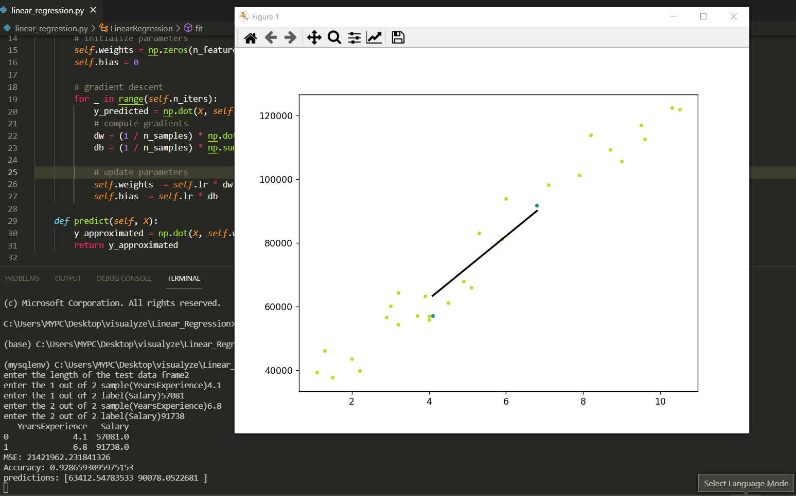

# Linear_Regression_From_Scratch

### for testing using user input
#### 1. Enter the LENGHT of the test DataFrame
#### 2. Input the SAMPLE >> ENTER >> LABEL till DataFrame appends.
#### Regression line, predictions,accuracy will be displayed as shown
